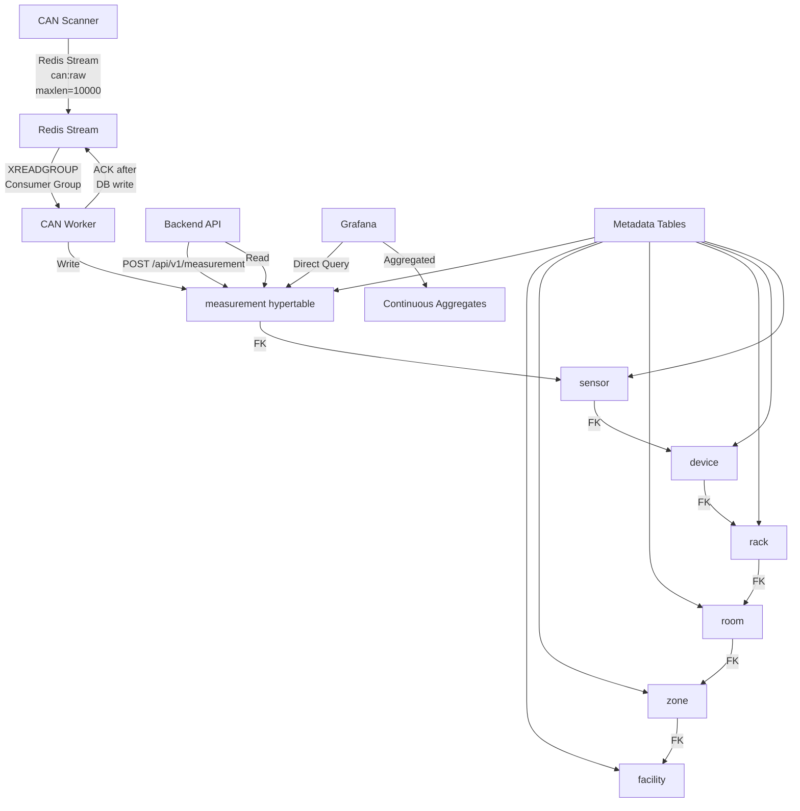

# CEA Database Schema Implementation

## Overview

Implement a normalized database schema for the CEA project with metadata tables and a unified time-series measurement table. Migrate all existing data from the current `can_messages` table to the new schema structure.

## Architecture



## Implementation Steps

### 1. Database Schema Creation

**File**: `Database/cea_schema.sql`

Create SQL script with:

- Metadata tables: `facility`, `zone`, `room`, `rack`, `device`, `sensor`
- Time-series table: `measurement` (hypertable with compression)
- Optional tables: `crop_batch`, `setpoints`, `actuator_events`
- All foreign keys, indexes, and constraints
- TimescaleDB hypertable creation on `measurement.time`
- **Compression policy**: Compress chunks older than 90 days
- **Continuous aggregates**: 
  - `measurement_hourly`: Hourly min/max/avg per sensor
  - `measurement_daily`: Daily min/max/avg per sensor
- **Indexes**: `(sensor_id, time DESC)` for fast queries

### 2. Data Migration Script

**File**: `Database/migrate_to_normalized_schema.py`

Script to:

- Read existing `can_messages` table
- **Metadata generation** (deterministic from node_id):
  - Create single facility: "CEA Facility"
  - Create zones: None (optional, can add later)
  - Create rooms from node_id mapping:
    - node_id 1 → "Flower Room" (back)
    - node_id 2 → "Flower Room" (front) 
    - node_id 3 → "Veg Room" (main)
    - node_id 4 → "Lab" (main)
    - node_id 5 → "Outside" (main)
  - Create devices: One per unique node_id (type derived from message_type)
  - Create sensors: One per unique sensor name pattern (dry_bulb_b, co2_f, rh_v, etc.)
- Migrate all measurements from `can_messages.decoded_data` JSONB to `measurement` table
- Preserve all timestamps and values
- Verify data integrity: row counts, value ranges, timestamp ranges
- **No double-writes**: This script only migrates historical data; new writes go directly to new schema

### 3. Update CAN Worker

**Files**:

- `CAN Bus/can-worker/app/writer.py`
- `CAN Bus/can-worker/app/redis_client.py`
- `CAN Bus/can-worker/app/main.py`

**Changes**:

**Writer (`writer.py`)**:

- Write to new `measurement` table instead of old normalized tables (temperature_readings, etc.)
- Look up `sensor_id` from sensor table based on sensor name
- Insert single row per sensor reading into `measurement` hypertable
- **No double-writes**: Remove all old table writes when new schema is ready

**Redis Client (`redis_client.py`)**:

- Implement Redis Stream consumer groups for crash safety
- Use `XREADGROUP` instead of `XREAD`
- Only ACK messages after successful DB write
- Handle backpressure: monitor stream length and log warnings if growing too fast
- Consumer group name: `can-worker-group`, consumer name: `can-worker-1`

**Main Loop (`main.py`)**:

- Update to use consumer group reads
- ACK messages only after `data_writer.write()` returns success
- Handle pending messages on startup (reprocess unacked messages)

### 4. Backend API Updates

**Files**:

- `Infrastructure/backend/app/database.py`
- `Infrastructure/backend/app/routes/sensors.py`
- `Infrastructure/backend/app/routes/measurement.py` (new)

**Changes**:

- Update `DatabaseManager` to query new `measurement` table with joins to sensor/device/room
- Add new route file for measurement ingestion: `POST /api/v1/measurement`
- Update existing sensor routes to use new schema
- Maintain API compatibility for existing frontend

### 5. Update Monitoring Scripts

**Files**:

- `monitor_can_db.sh`
- `monitor_redis_backend.sh`

**Changes**:

**monitor_can_db.sh**:

- Update database queries to use new `measurement` table instead of `can_messages`
- Join with `sensor`, `device`, `room` tables to display metadata:
  - Query: `SELECT m.time, s.name as sensor_name, r.name as room_name, d.name as device_name, m.value, m.status FROM measurement m JOIN sensor s ON m.sensor_id = s.sensor_id JOIN device d ON s.device_id = d.device_id JOIN room r ON d.room_id = r.room_id ORDER BY m.time DESC LIMIT 10`
- Display format: Show room name, sensor name, device name, value, timestamp
- Add monitoring for consumer group status:
  - Show pending messages: `XPENDING can:raw can-worker-group`
  - Show unacked message count
  - Display consumer lag if any
- Keep Redis live values display (unchanged)
- Add section showing measurement ingestion rate (measurements per second)

**monitor_redis_backend.sh**:

- Add consumer group monitoring:
  - Show pending messages count: `XPENDING can:raw can-worker-group`
  - Show consumer lag: Compare stream length vs processed messages
  - Display consumer group status
- Add backpressure warning: If stream length > 5000, show warning in yellow/red
- Add new schema health check:
  - Query `measurement` table: Count of recent measurements (last hour)
  - Show latest measurement timestamp
  - Verify schema is accessible
- Keep existing Redis stream and sensor value displays
- Add section showing measurement ingestion rate (measurements per second)

### 6. Update Start Service Script

**File**: `start_all_services.sh`

**Changes**:

- Verify script still works with new schema
- Add verification step: Check that new schema tables exist before starting services
- Optional: Add health check after services start to verify new schema is accessible

### 7. Configure Autostart on Boot

**Files**: All service files (already have `WantedBy=multi-user.target`)

**Actions**:

- Create script: `enable_autostart.sh` to enable all services for autostart
  - Script should run `systemctl enable <service>` for each service
  - Show status of each service (enabled/disabled)
  - Verify services are enabled after running script
  - Output should show:
    - Which services were already enabled
    - Which services were newly enabled
    - Any services that failed to enable (with error message)
- Document: Add to deployment checklist that services need to be enabled
- Verify: All services have `WantedBy=multi-user.target` in `[Install]` section
- Services to enable:
  - `redis-server.service` (usually enabled by default, but verify)
  - `postgresql.service` (usually enabled by default, but verify)
  - `can-setup.service`
  - `can-scanner.service`
  - `can-worker.service`
  - `cea-backend.service`
  - `automation-service.service`

### 8. Documentation Updates

**Files**:

- `Database/REQUIREMENTS.md` (create/update)
- `Infrastructure/IMPLEMENTATION_SUMMARY.md` (update)

Document:

- New schema structure
- Migration process
- API endpoints
- Grafana query examples for new schema
- Monitoring script updates
- Autostart configuration

## Database Schema Details

### Metadata Tables

- `facility`: Top-level facility (e.g., "CEA Facility")
- `zone`: Zones within facility (optional grouping)
- `room`: Rooms (e.g., "Flower Room", "Veg Room") with optional target_vpd/target_temp
- `rack`: Racks within rooms (optional)
- `device`: Devices (CAN nodes) with type, IP, serial number
- `sensor`: Individual sensors with name, unit, data_type, channel, calibration_offset

### Measurement Table

- `time` (timestamptz): Measurement timestamp
- `sensor_id` (FK): Reference to sensor
- `value` (float): Sensor reading value
- `status` (text, optional): Status indicator

Indexes: `(sensor_id, time DESC)` and time index for chunking

### Optional Tables

- `crop_batch`: Track crop batches per room
- `setpoints`: Room-level setpoints with timestamps
- `actuator_events`: Device control events

## Migration Strategy

1. **Create new schema** alongside existing `can_messages` table (no downtime)
2. **Populate metadata** using deterministic node_id mapping (prevents accidental room creation)
3. **Migrate historical measurements** from `can_messages.decoded_data` JSONB to `measurement` table
4. **Update CAN worker** to write directly to new schema (remove old table writes)
5. **Verify data integrity** and performance
6. **Keep old schema** as backup (don't delete, but stop writing to it)

**Critical**: No parallel writes during migration. New data goes directly to new schema once worker is updated.

## API Endpoint

**POST /api/v1/measurement**

Request body:

```json
{
  "time": "2024-01-15T10:30:00Z",
  "s edit my dont ensor_id": 123,
  "valthat will chnage is that  autostart on bootrdingly ,and my service restart ue": 23.5,
  "status": "ok"
}
```

Response: 201 Created with measurement record

## Performance Considerations

- 50 sensors × 1 sample/second = 4.3M datapoints/day
- **Compression policy**: Enable TimescaleDB compression on chunks older than 90 days
- **Retention policy**: 90 days raw data, then compress (configurable)
- **Continuous aggregates**: Create hourly and daily aggregates for Grafana dashboards
  - Hourly: min, max, avg per sensor per hour
  - Daily: min, max, avg per sensor per day
  - Reduces query time from minutes to seconds for long time ranges
- **Indexes**: `(sensor_id, time DESC)` for fast time-series queries

## Grafana Integration

Update Grafana queries to use new schema:

- **Raw data queries**: Join `measurement` → `sensor` → `device` → `rack` → `room` → `zone` → `facility`
- **Aggregated queries**: Use continuous aggregates for hourly/daily views (much faster)
- Filter by room name, sensor name, time range
- **Example queries**:
  - Recent data (< 90 days): Query `measurement` table directly
  - Historical data (> 90 days): Query continuous aggregates (hourly/daily)
  - Real-time: Use Redis state keys (existing pattern)

## Testing Checklist

- [ ] Schema creation script runs successfully
- [ ] Continuous aggregates created and refresh correctly
- [ ] Compression policy works (test with old timestamps)
- [ ] Migration script preserves all data (verify row counts, value ranges)
- [ ] CAN worker writes to new schema (no old table writes)
- [ ] Redis consumer groups work correctly (ACK after DB write)
- [ ] Backpressure handling: Monitor stream length during high load
- [ ] Backend API reads from new schema
- [ ] POST /api/v1/measurement endpoint works
- [ ] Grafana queries work with new schema (raw and aggregated)
- [ ] Performance meets requirements (4.3M/day ingestion rate)
- [ ] No double-writes verified (check old tables are not being written to)
- [ ] Monitoring scripts updated and working with new schema
- [ ] Start service script verifies schema before starting
- [ ] All services enabled for autostart on boot
- [ ] Consumer group monitoring shows correct status
- [ ] Backpressure warnings work correctly