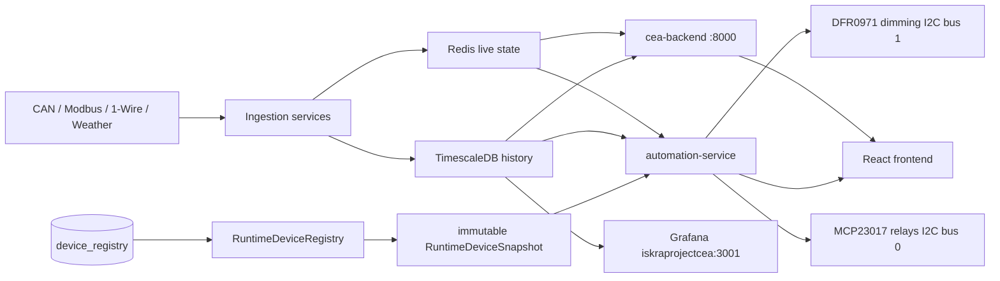

# ProjectCEA System Architecture

Single current-checkout architecture document. Deployment state may lag behind this source; the deployed snapshot is external at `/opt/projectcea/current/deploy_manifest.json`.

## End-to-End Flow



## Service Inventory

| Service | Unit | Port | Role |
|---|---|---|---|
| can-setup | can-setup.service | n/a | Bring up `can0` |
| can-processor | can-processor.service | n/a | CAN bus → Redis stream + DB |
| cea-backend | cea-backend.service | 8000 | Sensor API, WebSocket |
| onewire-worker | onewire-worker.service | 8004 | 1-Wire temperatures → Redis |
| soil-sensor-service | soil-sensor-service.service | 8002 | Modbus soil → Redis + DB |
| weather-service | weather-service.service | 8003 | YUL METAR → Redis + DB |
| automation-service | automation-service.service | 8001 | Control loop, device registry, SPA host |
| redis-aof-check | redis-aof-check.service | n/a | Boot-time AOF check |

Source: `Infrastructure/services.yaml`.

## Timing Contracts

| Constraint | Value | Source |
|---|---|---|
| Sensor sampling | 1 Hz minimum | Ingestion design target |
| Control tick | 1 s | `automation_config.yaml` `control.update_interval` |
| Valid tick range | 1–5 s | `app/models/config_schema.py` validation |
| Redis hot-path operations | under 1 ms | Control-loop requirement |
| DB batch delay | at most 100 ms | `db_batch_writer.py` target |

## Hardware Boundaries

| Hardware | Bus | Address | Role | Source |
|---|---|---|---|---|
| MCP23017 | I2C bus 0 | 39 decimal (`0x27`) | 16 relay channels 0–15 | `automation_config.yaml` |
| DFR0971 board 0 | I2C bus 1 | 88 decimal (`0x58`) | Dimming channels | `automation_config.yaml` |
| DFR0971 board 1 | I2C bus 1 | 89 decimal (`0x59`) | Dimming channels | `automation_config.yaml` |
| DFR0971 board 2 | I2C bus 1 | 90 decimal (`0x5A`) | Dimming channels | `automation_config.yaml` |

MCP23017 is relay-only. DFR0971 is dimming-only. Their I2C buses are never swapped.

## Device Registry and Control Snapshot

`device_registry` is the sole source of truth for device identity, room/cluster placement, relay channel bindings, DFR board/channel bindings, and capabilities. No YAML device definitions, commissioning subsystem, or duplicate assignment map participates in runtime control.

Startup installs one immutable `RuntimeDeviceSnapshot` per tick. The snapshot freezes hierarchy, device indexes, mode parameters, light intensity anchors, and light programs. An empty registry is a valid state: it installs a ready empty snapshot and emits no relay-ON or nonzero DFR command.

| Component | Responsibility |
|---|---|
| `device_registry` | Persistent device, relay, and DFR assignments |
| `RuntimeDeviceRegistry` | Build and atomically publish the current snapshot |
| `RuntimeDeviceSnapshot` | Immutable control-tick projection |
| `DeviceRegistryService` | Sole supported mutation path; validates uniqueness and performs safe output sequencing |
| `RelayBoardStateManager` | Sole owner and sampler of observed MCP23017 board state |
| `Scheduler` | Installs snapshot-derived mode, light intensity, light program, and device lookup caches as one readiness operation |

`GET /api/devices/control-snapshot` joins the strict registry snapshot, MCP relay observation, assigned-device command state, and DFR commanded/acknowledged intensity into one read model.

## Scheduling and Control

Each tick:

1. Read sensor state from Redis.
2. Capture the current `RuntimeDeviceSnapshot` once.
3. Resolve photoperiod from `mode_parameters` and light targets from `light_target_intensity`.
4. Apply supplemental or override light programs from `light_programs`.
5. Evaluate VPD-led climate logic.
6. Send relay commands through MCP23017 and dimming commands through DFR0971.
7. Persist live state to Redis and history to TimescaleDB.

Photoperiod is room/mode-level and supports overnight windows. Each light intensity is keyed by `(device_id, mode_id)`. A missing intensity anchor falls back to 10%. A missing photoperiod configuration is a critical alarm condition.

The global heating-failure↔exhaust interlock is not currently configured; it was removed per `automation_config.yaml` line 77.

## Cluster Topology

Device cluster `main` is distinct from Flower Room sensor sub-clusters `front` and `back`.

| Room | Device cluster | Sensor URL slugs |
|---|---|---|
| Flower Room | `main` | `front`, `back` |
| Veg Room | `main` | `main` (sentinel) |
| Lab | `main` | `main` (sentinel) |
| Outside | `main` | `main` (sentinel) |

Sources of truth: `Infrastructure/shared/cluster_topology.py` (Python) and `Infrastructure/frontend/src/config/clusterTopology.ts` (frontend). The API rejects cross-type cluster lookups with HTTP 400 and an actionable hint.

## Redis and TimescaleDB

Redis holds live state and streams. `sensor:raw` is the main telemetry stream; `stream:control` carries effective-setpoint decisions. Both streams cap at 100,000 entries (`Infrastructure/shared/redis_keys.py`).

TimescaleDB on the Pi primary holds history and configuration. It streams WAL to the Iskra standby (`iskraprojectcea`). Grafana on Iskra reads the local WAL replica; live current-value panels read Redis via `redis_sync`.

## Local Verification

The canonical local gates are:

```bash
cd Infrastructure/automation-service && ruff check . && ruff format --check . && python3 -m compileall -q app && pytest -q app/tests/pure
cd Infrastructure/frontend && npx tsc --noEmit && npm run build && npx vitest run src/components/devices/__tests__/targetValidation.test.ts src/components/devices/__tests__/relaySnapshot.test.ts
python3 Infrastructure/scripts/validate_cluster_topology.py
git diff --check
bash Infrastructure/scripts/tests/test-reset-device-registry.sh
bash Infrastructure/scripts/tests/test-deploy-candidate.sh
```

Production validation is not prescribed as the only surface.
