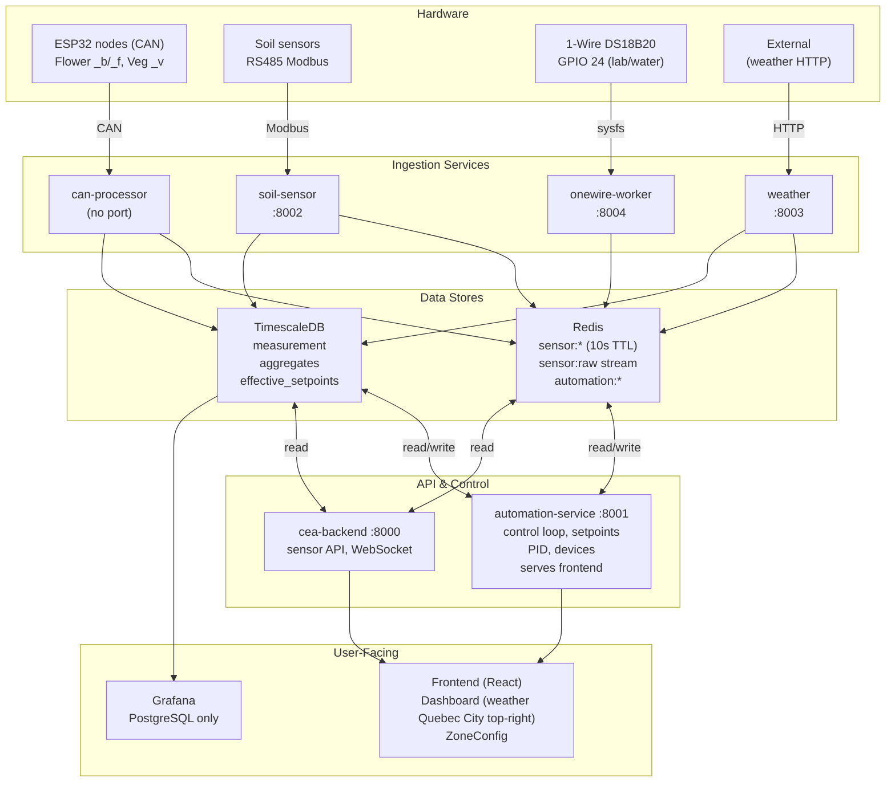
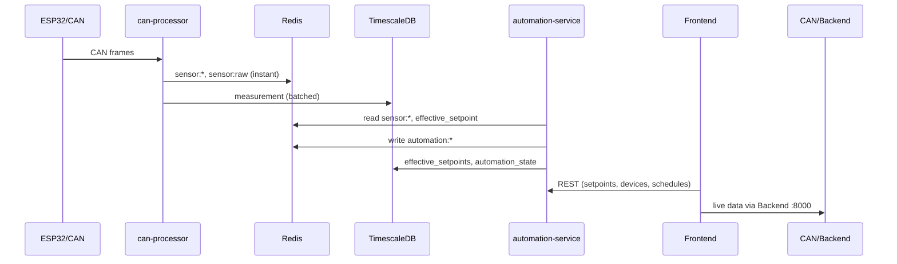

# ProjectCEA – Architecture Schematic (Plan-Agent Style)

**Last updated (deployed):** 2026-03-26 — Climate periods migration: light/climate decoupled, scheduler uses climate_periods table (named periods with ramp_minutes).

> This file is the plan-style schematic: diagram-first, structured sections. Keep in sync with `ARCHITECTURE.md`. When deploying relevant changes, update both and copy previous versions to **`archive/`** (project root) with dated filenames.

---

## TL;DR

- **System**: Raspberry Pi 5, 6 Python services + React, 2 grow rooms.
- **Data in**: CAN (ESP32), Modbus (soil), HTTP (weather) → Redis (live) + TimescaleDB (history).
- **Control**: automation-service 1–5 s tick; backend 8000 (sensors), automation 8001 (control + frontend).
- **Hardware**: MCP23017 relays (I2C 0), DFR0971 dimming (I2C 1). Deploy: `deploy.sh` / `rollback.sh`.

---

## Diagram (Mermaid – Plan-Agent Style)

---

## Data Flow (Simplified)

---

## Components

| Layer | Component | Role |
|-------|-----------|------|
| Hardware | ESP32 (CAN) | Flower Back/Front, Veg Main; 1 Hz sensors |
| Hardware | Soil (RS485) | soil-sensor-service reads Modbus |
| Hardware | 1-Wire DS18B20 | onewire-worker on GPIO 24 (lab temp, water temp) |
| Hardware | MCP23017 | Relays only, I2C bus 0, 16 channels |
| Hardware | DFR0971 | Dimming only, I2C bus 1, 6 channels |
| Ingest | can-processor | CAN → Redis state + stream + TimescaleDB |
| Ingest | soil-sensor-service | Modbus → Redis + TimescaleDB |
| Ingest | onewire-worker | 1-Wire sysfs → Redis (lab_temp, water_temperature) |
| Ingest | weather-service | External API → DB / Redis |
| Store | Redis | sensor:*, sensor:raw, automation:*, effective_setpoint:* |
| Store | TimescaleDB | measurement, aggregates, effective_setpoints, automation_state |
| API | cea-backend :8000 | Sensor API, WebSocket; no static UI |
| API | automation-service :8001 | Control loop, setpoints, devices, PID; serves frontend dist/ |
| UI | Frontend | React; backend 8000 + automation 8001 |
| UI | Grafana | Dashboards; PostgreSQL only |

---

## Control Loop (automation-service)

1. Read `sensor:*` from Redis.
2. Load config (zones, setpoints) from DB.
3. Scheduler: light mode (DAY/NIGHT sun/moon) + climate periods (named periods with ramp_minutes); effective setpoints resolved from climate_periods.
4. PID + VPD cascade; safety interlocks.
5. Device commands → MCP/DFR; state → Redis `automation:*` and DB.

**Tick:** 1–5 s (configurable; max 5 s non-negotiable).

---

## Deployment

| Action | Command / Path |
|--------|----------------|
| Deploy | `./deploy.sh` |
| Rollback | `./rollback.sh` (<30 s) |
| Prod root | `/opt/projectcea/current` → `releases/<timestamp>-<git>` |
| Dev root | `/home/antoine/ProjectCEA` |

**Startup order:** postgresql, redis → can-setup → can-processor, soil-sensor, weather → cea-backend, automation-service.

---

## Reference for Agents

- **Full narrative:** `ARCHITECTURE.md` (project root).
- **This file:** Plan-style schematic (Mermaid + tables); update both when architecture changes and a deploy is done.
- **Archive:** **`archive/`** at project root — dated copies (e.g. `ARCHITECTURE_SCHEMATIC_2026-01-30.md`).
