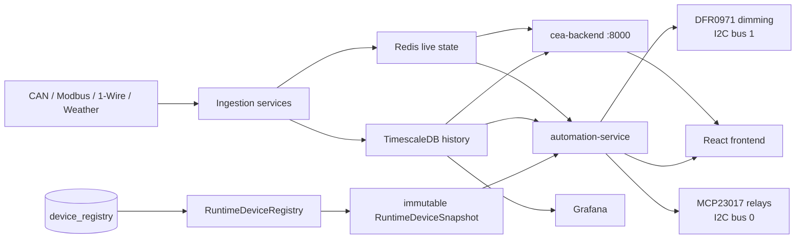
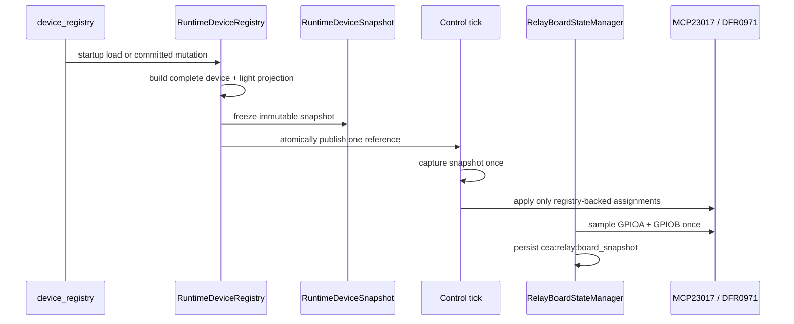
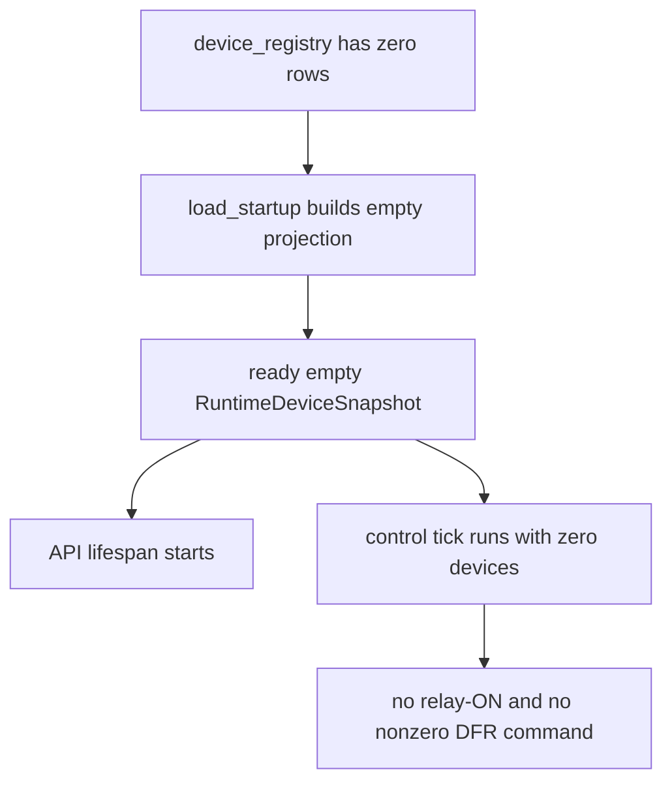

# ProjectCEA – Architecture Schematic

**Last updated (deployed):** 2026-07-12

**Prepared update:** 2026-07-29 — registry canonicalization is locally verified and deployment is pending explicit owner approval. The prior deployed schematic is retained as `archive/ARCHITECTURE_SCHEMATIC_2026-07-12.md`.

---

## End-to-End Flow

---

## Canonical Registry Flow

| Boundary | Contract |
|---|---|
| `device_registry` | Sole device, relay, and DFR source |
| `DeviceRegistryService` | Sole registry mutation path; validates conflicts and safe output sequencing |
| `RuntimeDeviceSnapshot` | Immutable and complete for one control tick |
| `RelayBoardStateManager` | Sole MCP board sampler and snapshot owner |
| `automation_config.yaml` | Service configuration only; no device definitions |
| Commissioning subsystem | Removed; not part of startup or control |

---

## Empty Registry Contract

The empty registry is a supported safe state for the operator-controlled reset/rebuild workflow. It is not a cue to recreate YAML devices or run an automatic commissioning process.

---

## Operator-Only Reset Boundary

`Infrastructure/scripts/reset-device-registry.sh` is intentionally destructive, guarded by `--confirm`, and limited to registry-dependent reset tables. It is never invoked by tests, agents, or the control service. Deployment and reset remain separate owner actions.

---

## Operational Constants

| Item | Value |
|---|---|
| Control tick | 1–5 seconds |
| Sensor update | 1 Hz minimum |
| Redis hot path | under 1 ms |
| DB batch delay | at most 100 ms |
| Relay hardware | MCP23017 only, bus 0 |
| Dimming hardware | DFR0971 only, bus 1 |
| Device cluster | `main` only |
| Flower sensor URL slugs | `front`, `back` |
